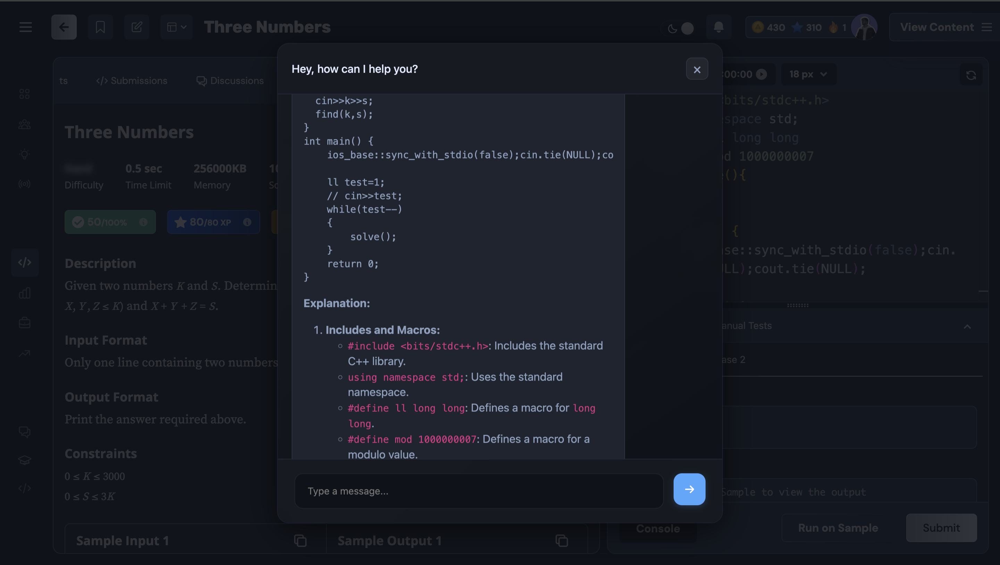
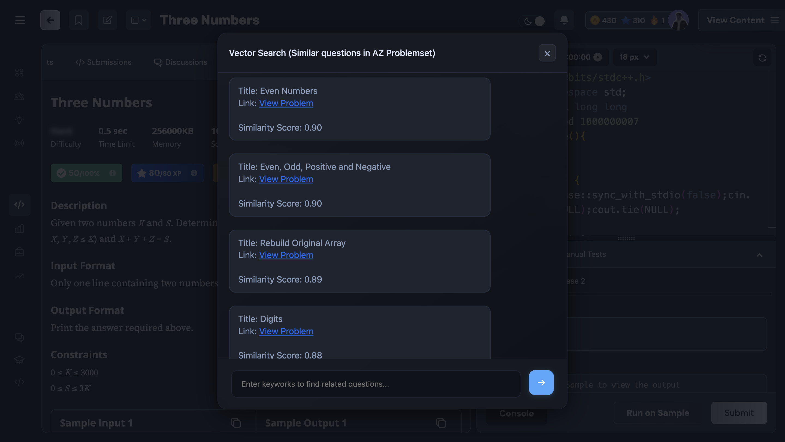

# AI Helper Extension

## 🚀 Demo Video

[Click to Watch](https://youtu.be/D5OpcMHzU-w)




---

## 📄 Description

The **AI Helper Extension** is a Chrome extension designed to help your DSA problem-solving experience. By leveraging advanced AI models, it provides users with real-time assistance and intelligent search features for a seamless coding journey.

### Key Highlights:

- 💡 **AI Assistance**: Receive detailed solutions, hints, and explanations tailored to your DSA problems.
- 🔍 **Vector Search**: Effortlessly find related problems based on the context of the current question or a custom query.
- 📂 **Conversation History**: Never lose track of your interactions with AI.

---

## ✨ Features

### 1. **AI Helper**

- Real-time explanations, hints, and solutions for DSA problems.
- Uses **Gemini 2.0 Flash Exp**

### 2. **Context**

- The AI model has context to entire details of the problem.
- The extention also keeps track of code written in the editor.

### 3. **Vector Search**

- Search for related problems using a query or the current question’s context.
- Utilizes the **multilingual-e5-large** model for generating accurate embeddings.
- Efficiently fetches results via **Pinecone** vector database.

### 4. **Conversation History**

- Stores all interactions for future reference using **MongoDB**.

### 5. **Backend**

- Backend services are hosted on **Vercel** for quick and reliable performance.

---

## 🛠️ Installation

1. **Clone or Download the Extension**:

   ```bash
   git clone https://github.com/Piyushjha03/ai-helper-extention.git

   ```

2. **Enable Developer Mode in Chrome:**
   Open Chrome and go to chrome://extensions/.
   Enable Developer mode using the toggle switch in the top-right corner.

3. **Load the Extension:**

   Click on Load unpacked.
   Select the directory called extension.
   Start Using the Extension:

The extension will now appear in your Chrome toolbar. Navigate to any DSA problem-solving website and start solving problems with AI assistance!

---

## 🖥️ Tech Stack

- **AI Model**: Gemini 2.0 Flash Exp
- **Vector Embedding**: Multilingual-e5-large
- **Vector Database**: Pinecone
- **Conversation History**: MongoDB
- **Hosting**: Vercel
- **Frontend**: Chrome Extension(Javascript)

---
